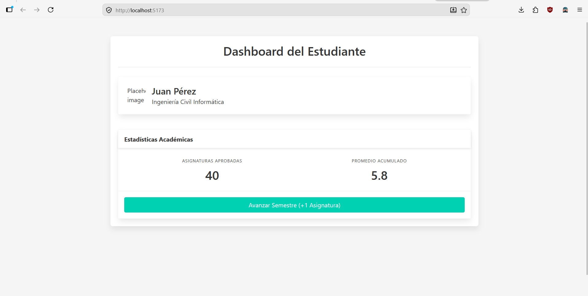

# WORKSHOP_06

En este taller, avanzarás en tu dominio de Vue.js explorando la comunicación entre componentes y el manejo del ciclo de vida de la aplicación. El objetivo es construir un Panel de Usuario Dinámico (Dynamic User Dashboard) que demuestre el flujo de datos unidireccional y la ejecución de código al inicializar la página.

El proyecto debe incluir lo siguiente:

* **Estructura de Componentes:** Separación clara entre un componente padre (`App.vue`) y al menos dos componentes hijos (ej., `UserProfile.vue` y `UserStats.vue`).

* **Uso de Props:** El componente padre debe centralizar los datos del usuario y distribuirlos a los componentes hijos utilizando propiedades (`defineProps`).

* **Ciclo de Vida (`onMounted`):** Implementar el hook `onMounted` para simular la carga de datos. Cuando la página carga, los valores iniciales deben estar vacíos y "poblarse" automáticamente después de que el componente sea montado.

* **Reactividad y Estilos:** Usar `ref` para los datos cargados y aplicar estilos básicos (puedes usar Bulma o CSS nativo con el atributo `scoped`).

## Procedimiento de Entrega
Para la evaluación de este taller, se seguirá estrictamente el flujo de trabajo profesional utilizado en clases anteriores:

1. **Clonar el repositorio:**
   `https://github.com/LBrownI/workshop6_G003`.

2. **Lugar de trabajo:** Cada estudiante debe trabajar exclusivamente dentro de la carpeta que lleva su nombre.

3. **Entrega:** La entrega se considerará válida solo si se realiza mediante un **Pull Request** a la rama principal del repositorio antes del cierre del módulo.

## Puntos Extra (Bonus)
* **+1 punto en la nota del Taller:** Implementar un Evento Personalizado (`$emit`) donde un componente hijo notifique al padre de un cambio (por ejemplo, un botón "Actualizar Nombre" dentro del hijo que modifique el estado en el padre).

## Resultado Visual Esperado

---

# Rúbrica de Evaluación - Taller #6 (Vue.js 3)

**Ejecución del Proyecto:** El proyecto debe compilar y ejecutarse correctamente al correr el comando `npm run dev`. Si la aplicación lanza errores fatales por consola que impiden su renderizado, o si el código entregado no corresponde a un proyecto Vue válido, la calificación es automáticamente la nota mínima (**1.0**).

---

## Rúbrica de Evaluación (Distribución de 6.0 puntos)

### 1. Estructura y Modularidad (1.5 puntos)
* **Logrado (1.5):** La interfaz está correctamente dividida. Existe un componente padre (`App.vue`) que importa y renderiza al menos dos componentes hijos distintos (ej. `UserProfile.vue`, `UserStats.vue`).
* **Medianamente Logrado (0.7):** Crea componentes hijos, pero la separación lógica no es clara o incluye demasiada interfaz en el componente padre.
* **No Logrado (0.0):** Todo el código está amontonado en `App.vue` sin instanciar componentes hijos.

### 2. Flujo de Datos con Props (1.5 puntos)
* **Logrado (1.5):** El componente padre declara el estado (datos) y lo pasa correctamente a los hijos utilizando la directiva `:` (`v-bind`) y recibiéndolos con `defineProps`.
* **Medianamente Logrado (0.7):** Intenta usar props, pero define los datos directamente en el componente hijo o comete errores de sintaxis al inyectarlos en el template.
* **No Logrado (0.0):** No utiliza props; cada componente maneja datos aislados que no se comunican entre sí.

### 3. Ciclo de Vida y Reactividad (1.5 puntos)
* **Logrado (1.5):** Utiliza correctamente `ref` para declarar datos iniciales vacíos y usa el hook `onMounted` para actualizar esos valores simulando una carga inicial.
* **Medianamente Logrado (0.7):** Usa `ref` correctamente, pero no utiliza `onMounted` (puebla los datos estáticamente desde el inicio) o viceversa.
* **No Logrado (0.0):** No hay reactividad ni uso del ciclo de vida.

### 4. Flujo de Trabajo en GitHub (1.5 puntos)
* **Logrado (1.5):** Clona el repositorio oficial, trabaja exclusivamente dentro de su carpeta personal, y realiza el Pull Request hacia la rama principal con sus cambios.
* **Medianamente Logrado (0.7):** Realiza el Pull Request, pero modifica archivos fuera de su carpeta o incluye la carpeta `node_modules`.
* **No Logrado (0.0):** No realiza el Pull Request o entrega el trabajo por un canal no autorizado.

---

## 🌟 Bonificación

* **Eventos Personalizados (`$emit`): +1.0 punto a la nota final.** El estudiante logra que un componente hijo modifique el estado del padre emitiendo un evento y pasando un payload (dato nuevo).
